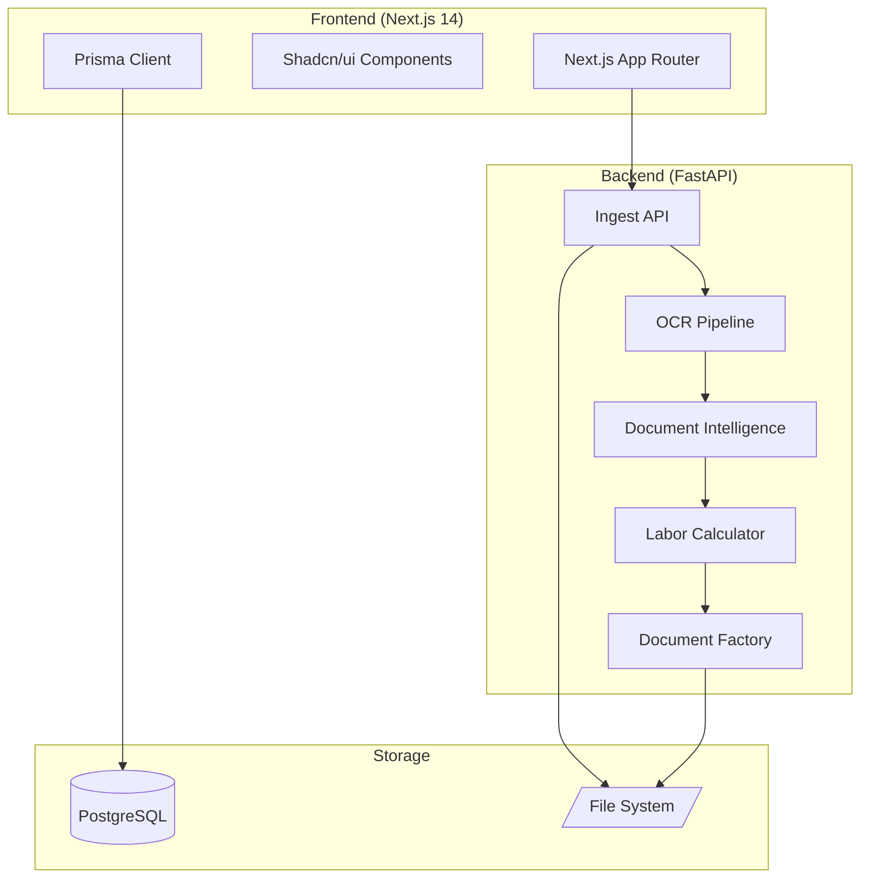
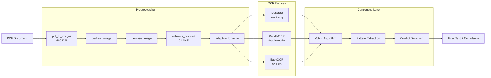
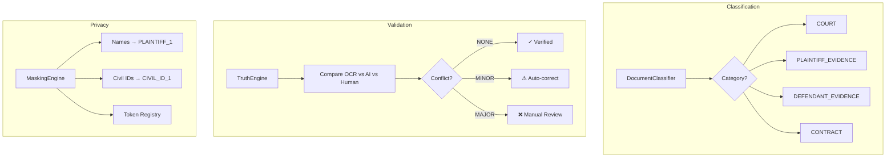

# ExpertOS: OCR Optimization Branch — Architecture Analysis

> **Branch:** `ocr-optimization-2026`  
> **Repository:** https://github.com/dmitrynovikov21/oman  
> **Date:** 2026-02-02

---

## 1. 🏗️ Architecture Overview

ExpertOS — это **цифровая фабрика для судебных экспертов в Омане**. Платформа автоматизирует:

1. **Прием и OCR документов** (арабский язык, сканы, PDF)
2. **Расчет трудовых выплат** по законодательству Омана (Royal Decree 35/2003)
3. **Генерацию арабских юридических документов** (DOCX → PDF с RTL)
4. **Case Management** для экспертов



---

## 2. 💾 Tech Stack

### Frontend (Next.js 14)
| Component | Technology |
|-----------|------------|
| Framework | Next.js 14.2.5 (App Router) |
| Auth | NextAuth v5 (beta.19) + Prisma Adapter |
| UI | Shadcn/ui + Radix UI + Tailwind CSS |
| ORM | Prisma 5.17 |
| Payments | Stripe |
| Email | Resend + React Email |
| Analytics | Vercel Analytics |

### Backend (Python FastAPI)
| Component | Technology |
|-----------|------------|
| Framework | FastAPI 0.109 + Uvicorn |
| OCR Engines | PaddleOCR 2.7, EasyOCR 1.7, Tesseract |
| Image Processing | OpenCV 4.9, Pillow, NumPy |
| Document Gen | docxtpl + LibreOffice (PDF) |
| NLP/Fuzzy | thefuzz + python-Levenshtein |
| Date Conversion | hijri-converter |
| Database | SQLAlchemy + psycopg2 |

---

## 3. 🔑 Core Modules

### 3.1 OCR Pipeline (Ensemble Architecture)

Ключевая особенность ветки — **ансамблевый OCR для арабского языка**. Три движка работают параллельно:



**Файлы:**
- [ensemble_ocr.py](file:///Users/dimanovikov/Desktop/oman-land/backend/ensemble_ocr.py) — основной ансамбль с голосованием
- [ocr_consensus.py](file:///Users/dimanovikov/Desktop/oman-land/backend/ocr_consensus.py) — Dual OCR (PaddleOCR vs EasyOCR) с верификацией
- [opencv_preprocessor.py](file:///Users/dimanovikov/Desktop/oman-land/backend/opencv_preprocessor.py) — пайплайн предобработки изображений
- [parallel_ocr.py](file:///Users/dimanovikov/Desktop/oman-land/backend/parallel_ocr.py) — параллельный запуск движков

### 3.2 Document Intelligence

Система классификации и валидации документов:



**Файлы:**
- [document_intelligence.py](file:///Users/dimanovikov/Desktop/oman-land/backend/document_intelligence.py) — DocumentClassifier, TruthEngine, BatchProcessor
- [intelligent_validation.py](file:///Users/dimanovikov/Desktop/oman-land/backend/intelligent_validation.py) — LegalRefiner с fuzzy matching по оманскому юр. словарю
- [privacy_masking.py](file:///Users/dimanovikov/Desktop/oman-land/backend/privacy_masking.py) — PII anonymization перед отправкой в AI

### 3.3 Oman Labor Calculator

Калькулятор выплат по Omani Labor Law (Royal Decree 35/2003):

```
Total Award = EOSB + Notice Pay + Leave Pay + Unfair Dismissal

EOSB (End of Service Benefit):
- Years 1-3: (Basic / 30) × 15 days × years
- Years 4+:  (Basic / 30) × 30 days × years

Notice Pay: Gross × notice_months (forfeited if Article 40)
Leave Pay:  (Gross / 30) × unused_leave_days
PASI:       11.5% of Gross (for Omani nationals)
```

**Файл:** [oman_labor_calculator.py](file:///Users/dimanovikov/Desktop/oman-land/backend/oman_labor_calculator.py)

### 3.4 Document Factory

Генерация арабских юридических документов:

```
.docx Template → docxtpl fill → LibreOffice → PDF (Arabic RTL)
```

**Файл:** [document_factory.py](file:///Users/dimanovikov/Desktop/oman-land/backend/document_factory.py)

---

## 4. 📊 Data Structures

### Prisma Schema (Core Models)

```prisma
model Case {
  id              String   @id @default(cuid())
  caseNumber      String   // e.g., "1234/2024"
  year            Int
  courtName       String?
  status          String   @default("DRAFT") // DRAFT, ACTIVE, REVIEW, CLOSED
  plaintiffName   String?
  defendantName   String?
  feeAmount       Float?
  paymentStatus   String   @default("UNPAID")
  
  documents       Document[]
  calculations    Calculation[]
  meetings        Meeting[]
}

model Document {
  id              String   @id
  caseId          String
  type            String   @default("OTHER") // MANDATE, CLAIM, CONTRACT, EVIDENCE
  ocrStatus       String   @default("PENDING") // PENDING, PROCESSING, DONE, FAILED
  extractedText   String?
}

model Calculation {
  id              String   @id
  caseId          String
  scenarioType    String   @default("LEGAL_DEFAULT") // LEGAL_DEFAULT, PLAINTIFF_CLAIM
  totalEosb       Float?
  totalLeave      Float?
  unfairMonths    Int?
  detailsJson     String?  // JSON blob with full breakdown
}
```

### Python Data Classes

```python
@dataclass
class DetailedBreakdown:
    total_days: int
    years: Decimal
    eosb: Decimal
    notice_pay: Decimal
    leave_pay: Decimal
    unfair_dismissal: Decimal
    pasi_debt: Decimal
    total_award: Decimal
    nationality: str  # "OMANI" | "EXPAT"
    is_article_40: bool

@dataclass
class OCRResult:
    engine: str      # "tesseract" | "paddle" | "easyocr"
    text: str
    confidence: float
    boxes: Optional[List]

@dataclass
class ConsensusResult:
    field_name: str
    paddle_value: str
    easyocr_value: str
    final_value: str
    status: str      # "verified" | "conflict" | "single_source"
    confidence: float
    needs_review: bool
```

---

## 5. 🔌 API Endpoints

### FastAPI Backend (`main.py`)

| Method | Endpoint | Description |
|--------|----------|-------------|
| `GET` | `/` | Health check |
| `POST` | `/api/v1/ingest/upload` | Upload PDF/ZIP, create case, trigger OCR |
| `GET` | `/api/v1/cases/{case_id}/status` | Get OCR processing status |
| `GET` | `/api/v1/cases` | List all cases (paginated) |
| `DELETE` | `/api/v1/cases/{case_id}` | Delete case and files |

### Next.js API Routes

```
/app/api/
├── analytics/          # Dashboard stats
├── auth/               # NextAuth handlers
├── calculations/       # Labor law calculations
├── cases/              # CRUD for cases
├── documents/          # Document management
├── fees/               # Fee requests
├── ingest/             # Document upload proxy
├── ocr/                # OCR status
├── reports/            # Report generation
└── search/             # Full-text search
```

---

## 6. 🔐 Security & Privacy

1. **PII Masking:** Перед отправкой текста в внешний AI, все персональные данные маскируются:
   - Имена → `[PLAINTIFF_1]`, `[DEFENDANT_1]`
   - Civil ID (8 цифр) → `[CIVIL_ID_1]`
   - Телефоны → `[PHONE_1]`
   - Банковские счета → `[BANK_1]`

2. **Token Registry:** Хранит маппинг токенов для де-маскировки ответов AI

3. **CORS:** Настроен только для `localhost:3000` (dev)

---

## 7. 🚧 Known Issues & TODOs

1. **In-Memory Store:** `cases_store` в `main.py` — заглушка, нужна миграция на PostgreSQL
2. **ZIP Extraction:** Помечено как TODO в `upload_documents`
3. **Celery Integration:** Комментарий указывает на будущую интеграцию для фоновых задач
4. **LibreOffice Dependency:** PDF конвертация требует установки LibreOffice

---

## 8. 📁 Directory Structure

```
oman-land/
├── app/                    # Next.js App Router
│   ├── (auth)/             # Auth pages (login, register)
│   ├── (protected)/        # Protected dashboard pages
│   └── api/                # API routes (22 domains)
├── backend/                # FastAPI Python service
│   ├── main.py             # Entry point
│   ├── ensemble_ocr.py     # Multi-engine OCR
│   ├── ocr_consensus.py    # Dual OCR verification
│   ├── opencv_preprocessor.py
│   ├── document_intelligence.py
│   ├── intelligent_validation.py
│   ├── privacy_masking.py
│   ├── oman_labor_calculator.py
│   ├── document_factory.py
│   └── templates/          # DOCX templates
├── components/             # React components (120 files)
│   ├── ui/                 # Shadcn/ui primitives
│   ├── dashboard/          # Dashboard-specific
│   └── shared/             # Shared components
├── lib/                    # Utilities
│   ├── labor-law.ts        # TypeScript labor calculator
│   ├── date-utils.ts       # Hijri/Gregorian conversion
│   └── validation-utils.ts
├── prisma/
│   └── schema.prisma       # Database schema
└── config/                 # App configuration
```

---

## 9. ✅ Summary

Ветка `ocr-optimization-2026` представляет **production-ready OCR систему** для арабского языка с:

- **Ансамблем из 3 OCR движков** (PaddleOCR, EasyOCR, Tesseract)
- **Консенсусным алгоритмом** для верификации результатов
- **Предобработкой изображений** (deskew, denoise, CLAHE, binarization)
- **Fuzzy matching** по юридическому словарю Омана
- **Privacy-first архитектурой** с PII маскировкой
- **Калькулятором трудовых выплат** по Omani Labor Law
- **Генератором арабских документов** с RTL поддержкой

Платформа готова к интеграции с фоновой очередью задач (Celery) и миграции на PostgreSQL для production.
